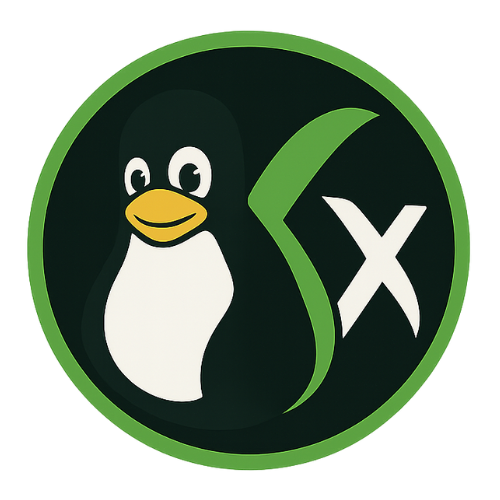

# 🎮 XCloud Launcher

**XCloud Launcher** is a sleek, cross-platform desktop launcher for [Xbox Cloud Gaming (xCloud)](https://xbox.com/play), tailored for **macOS** and **Linux**.  
It provides native-like gameplay with auto-login, gamepad detection, and more — no browser needed.



---

## 🚀 Features

- ✅ Auto-login to [xbox.com/play](https://xbox.com/play)
- ✅ Persistent login via cookies/localStorage
- 🎮 Gamepad detection and support
- 🎨 Custom native launcher UI
- 🖥️ Supports macOS `.dmg` and Linux `.AppImage`
- 🌒 Dark/light theme toggle *(coming soon)*
- 🕹️ Gamepad-to-mouse support *(planned)*
- 📦 Built with custom app icon and packaging

---

## 🧑‍💻 Tech Stack

- [Electron](https://www.electronjs.org/)
- [Node.js](https://nodejs.org/)
- HTML, CSS, and JavaScript

---

## 📦 Installation

### 🔧 Prerequisites

- Node.js ≥ 18
- npm ≥ 9
- macOS (ARM64) or Linux (x64 / ARM64)

---

### 🔨 Build from Source

```bash
git clone https://github.com/marcusperdue/xcloud-launcher.git
cd xcloud-launcher
npm install
npm run build
